# Glo* Component Library

A themed, mobile-friendly component library for Obsidian DatacoreJSX.

## Features

- **16 UI Components** - Buttons, toggles, progress bars, cards, inputs, selects, tabs, badges, dials, and more
- **Theme System** - Complete theme management with live preview and editing
- **Mobile-First** - All components optimized for touch with 44px minimum targets
- **Effects** - Glow, lift, press, and rainbow effects
- **Frontmatter Binding** - Components can read/write to note frontmatter
- **Gradient Utilities** - Preset gradients and builder functions

## Components

| Component | Description |
|-----------|-------------|
| **GloButton** | Versatile button with effects, icons, and sprites |
| **GloToggle** | Toggle switch with labels and animations |
| **GloBar** | Progress bar with draggable sprite |
| **GloCard** | Container with header, footer, and variants |
| **GloInput** | Text input with validation and frontmatter binding |
| **GloSelect** | Dropdown with search and multi-select |
| **GloTabs** | Tab navigation with multiple styles |
| **GloBadge** | Status badges and removable tags |
| **GloDial** | Circular dial for time/angle/percentage |
| **ColorPicker** | HSV color picker with presets |
| **GradientBuilder** | Visual gradient editor |
| **BackgroundPicker** | Combined color/gradient/image picker |
| **CalendarPicker** | Date selection widget |

## Quick Start

1. Install the **Datacore** plugin in Obsidian
2. Copy this vault or the `System/Scripts` folder to your vault
3. Open `System/Dashboards/Component-Showcase.md`

## Usage

```javascript
// Import a component
const { GloButton } = await dc.require(
    dc.fileLink("System/Scripts/Components/dc-gloButton.jsx")
);

// Use it in your datacorejsx block
<GloButton
    label="Click Me"
    icon="🎉"
    onClick={() => new Notice('Clicked!')}
/>
```

## Theme System

The Theme Studio provides complete theme management:

```javascript
// Include the Theme Studio widget
await dc.require(dc.fileLink("System/Scripts/Widgets/dc-themeStudio.jsx"))
```

or as a codeblock

```markdown
```datacorejsx
const scriptPath = "System/Scripts/Widgets/dc-themeStudio.jsx";
const target = dc.fileLink(scriptPath);
const result = await dc.require(target);
const view = result?.renderedView ?? result?.View ?? result;  
const Func = result?.Func ?? null;

return function View() {
    const currentFile = dc.useCurrentFile();
    if (Func) {
        return Func({ currentFile, scriptPath });
    }
    return view ?? <p>Failed to render</p>;
}
```

Create custom themes with the Theme Studio

## Folder Structure

```
System/
├── Scripts/
│   ├── Core/           # Theme provider and utilities
│   ├── Components/     # All UI components
│   └── Widgets/        # Theme Studio and dashboard widgets
├── Themes/             # Theme files and templates
└── Dashboards/         # Component showcase
```

## Requirements

- Obsidian v1.0+
- Datacore plugin
- Minimal Theme by Kepano
- Minimal Theme Settings
- Style Settings

## Showcase

### Default Themes

#### Theme Studio


---

#### Bars
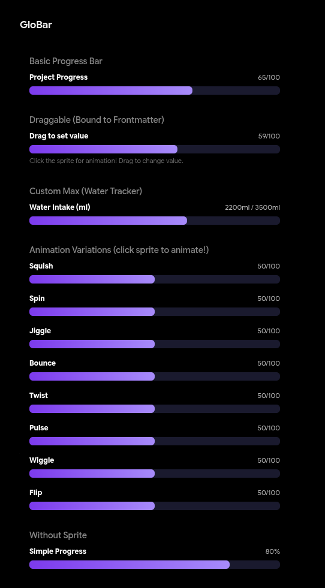

---

#### Toggles
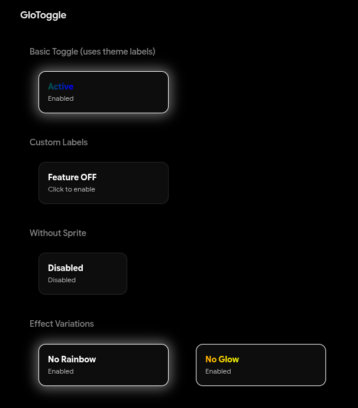

---

#### Buttons
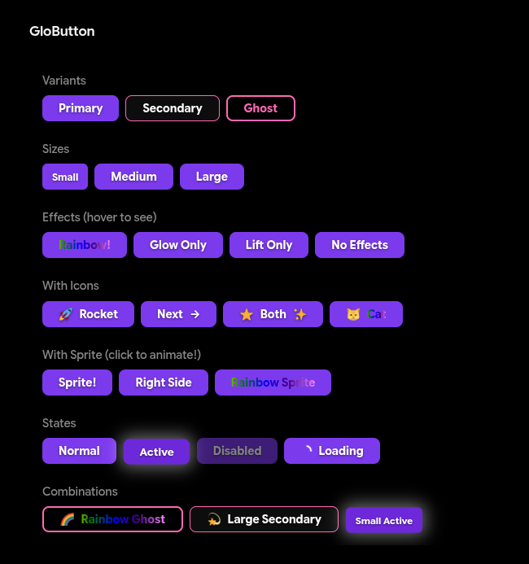

---

#### Selects
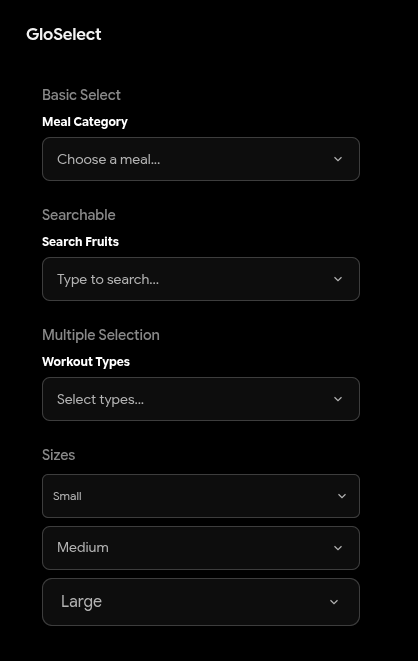

---

#### Inputs
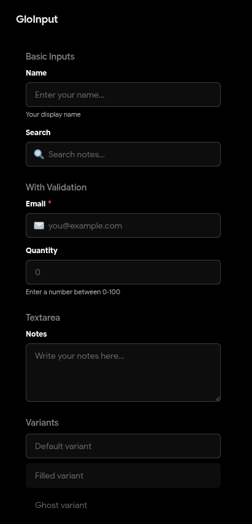

---

#### Cards
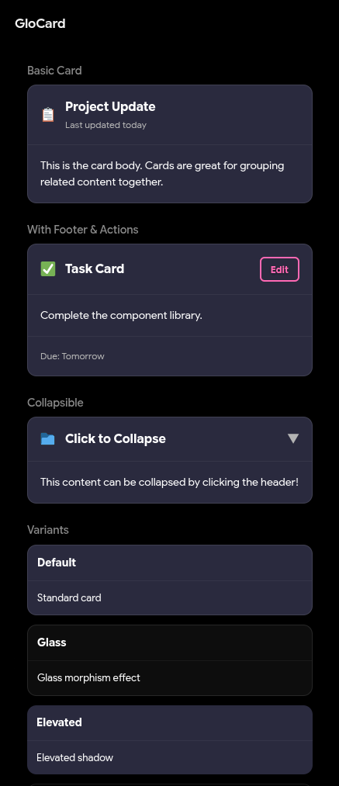

---

#### Dials
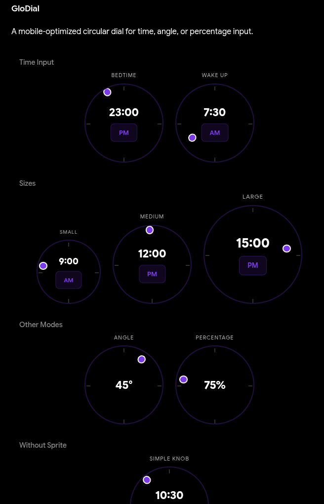

---

#### Badges
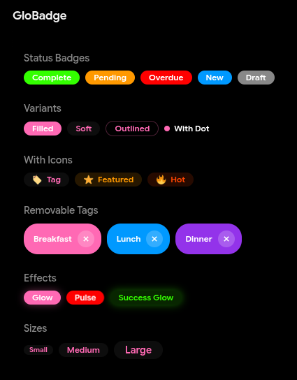

---

#### Tabs
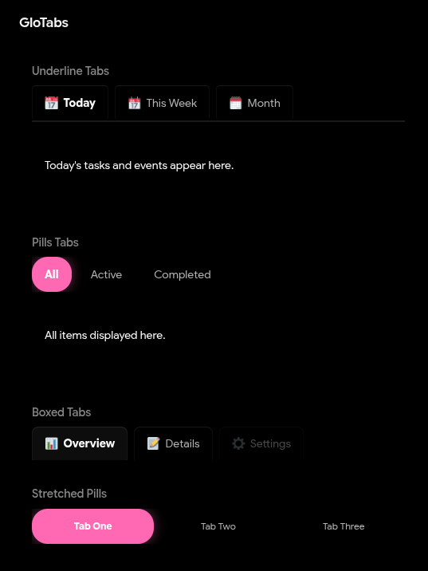

---

#### Gradients
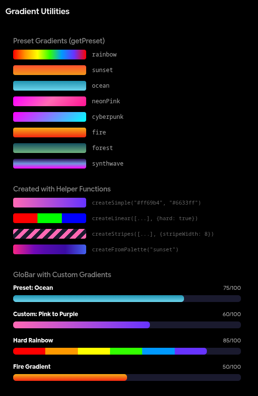

---

#### Vertical Bars
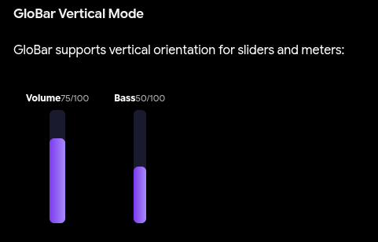

---

### Flashy Themes (DIY)

#### Bars


---

#### Toggles


---

#### Buttons


---

#### Selects and Inputs


---

#### Switching Themes


## Credits

Created by Rice AF (more like Potato AF)


